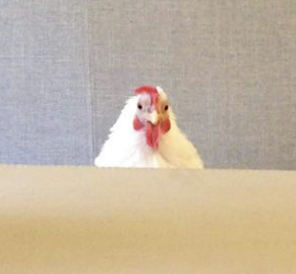

<!DOCTYPE html>
<html>
    <html style='overflow: hidden !important;'>
</html>

<head>
<meta charset="UTF-8">
<meta name="viewport" content="width=device-width, initial-scale=1.0">
<link rel="stylesheet" href="style.css">
<title>Home</title>
<link rel="icon" type="image/x-icon" href="favicon.ico?v=2"  />

</head>

<body>
    

        
           
        

            <ul class= "navigation">
                <a href="home.html" style="text-decoration:none"><li>HOME</li></a>
                <a href="about.html" style="text-decoration:none"><li>ABOUT</li></a>
                <a href="projects.html" style="text-decoration:none"><li>PROJECTS</li></a>
                <a href="contact.html" style="text-decoration:none"><li>CONTACT</li></a>
            </ul>
        

    

    

        
>WELCOME.

        
 Hello, and welcome to my website. Here you will find a collection of my work,
            information about myself as well as my contact information. 
            Thanks for stopping by!
        

    

    
</body>

</html>
